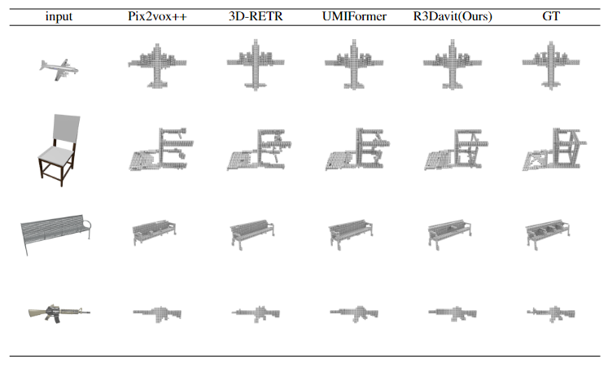
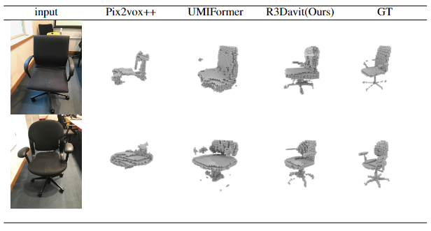
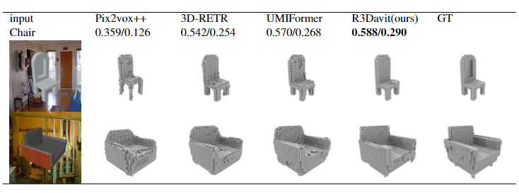

# R3Davit
code for Single-View 3D Reconstruction Via Dual Attention
Official PyTorch implementation of the paper: 

**Authors**: chenghuan li, meihua xiao, zehuan li, fangping chen, dingli wang.

## Performance on shapnet dataset , IOU/F1 both ↑ .

|category|  [Pix2Vox++(IJCV2020)](https://github.com/hzxie/Pix2Vox)            |3D-RETR(BMVC2021)(https://github.com/fomalhautb/3D-RETR)       |  [UMIFormer(ICCV2023)](https://github.com/GaryZhu1996/UMIFormer)    |[R3Davit(ours)(https://github.com/epicgzs1112/R3Davit)| 
| ------------------------------------------------------------ | --------------- | --------------- | --------------- | --------------- | 
| airplane | 0.673 / 0.549   | 0.705 / 0.593   | 0.701 / 0.581   | **0.726 / 0.613**   | 
| bench    | 0.607 / 0.445   | 0.654 / 0.498   | 0.644 / 0.483   | **0.674 / 0.515**   | 
| cabinet  | 0.798 / 0.405   | 0.808/ 0.422    | 0.818 / 0.435   | **0.826 / 0.451**   | 
| Car      | 0.857 / 0.541   | 0.859 / 0.548   | 0.864 / 0.555   | **0.873 / 0.576**   | 
| chair    | 0.581 / 0.286   | 0.589 / 0.292   | 0.609 / 0.305   | **0.623 / 0.323**   | 
| display  | 0.548 / 0.285   | 0.566 / 0.290   | **0.610 / 0.337**   | 0.603 / 0.331   | 
|lamp      | 0.456 / 0.319   | 0.478 / 0.328   | **0.510 / 0.357**   | 0.509 / 0.361   | 
|speaker   | 0.720 / 0.282   | 0.727 / 0.302   | **0.755 / 0.318**   | 0.748 / 0.314   | 
| rifle   | 0.617 / 0.547   | 0.671 / 0.606   | 0.674 / 0.606   | **0.684 / 0.618**   |
|sofa       | 0.724 / 0.375   | 0.736 / 0.387   | 0.747 / 0.400   | **0.761 /0.421** |
|  table      | 0.619 / 0.379   | 0.626 / 0.387 | 0.662 / 0.416 | **0.668 / 0.427** |
| telephone   | 0.809 / 0.613   | 0.768 / 0.542 | 0.809 / 0.600 | **0.835 / 0.641** |
|watercraft   | 0.602 / 0.383   | 0.636 / 0.418 | 0.645 / 0.424 | **0.656 / 0.444** | 
| overall         | 0.670 / 0.417 | 0.679 / 0.432 | 0.700 / 0.447 | **0.711 / 0.464** |

## Visual result on shapenet

##Visual result on shapenet with randombackground

##Visual result on real sence Pix3d dataset

## TODO

The code and pretrain models are coming soon.
- [x] Release the pretrain models
- [x] Release the code

## Installation
The environment was tested on Ubuntu 22.04LTS and. We trained R3Davit on 1 R4000 with 16 GB  for about 2 days.CUDA 11.3 torch 1.11.0 .
just pip install   xxxx.    no module named xxxx.  
or just create env from environment.yml file
conda env create -f environment.yml
conda activate R3DSWIN++

## Datasets

We use the [ShapeNet](https://www.shapenet.org/) and [Pix3D](http://pix3d.csail.mit.edu/) in our experiments, which are available below:

- ShapeNet rendering images: http://cvgl.stanford.edu/data2/ShapeNetRendering.tgz
- ShapeNet voxelized models: http://cvgl.stanford.edu/data2/ShapeNetVox32.tgz
- Pix3D images & voxelized models: http://pix3d.csail.mit.edu/data/pix3d.zip

## Get start
before training you need download the encoder  backbone network pretrain model and R3Davit train on shapenet pthfile   :https://drive.google.com/drive/folders/13h4Z_v9qUBDdH7Y3Pve8NwhogsWxhQRg?usp=drive_link
,https://drive.google.com/drive/folders/1zGtJQr1HM60qYZBPsDBW8-7NzZgrXsUN?usp=drive_link.
### Training
after ensure the dataset path is right in config.py,just run the runner.py.
-config.py   -> runner.py

### Evaluation
when eval just add --test --weights pathtoweight   paprameter in  correspond runner.py   file . 
-config.py   -> runner.py  --test --weights pathtoweight trained on shapnet    eval on shapenet

## Citation
waiting for accepted!

